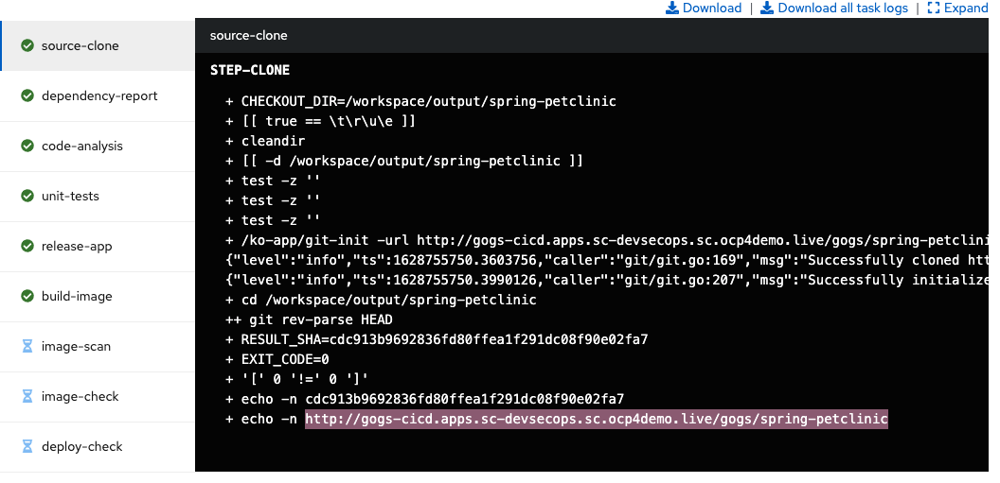
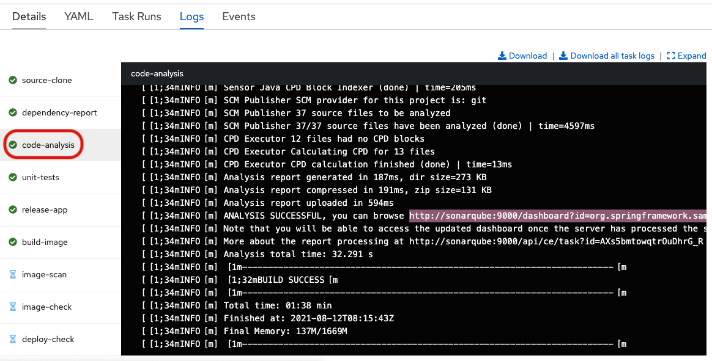
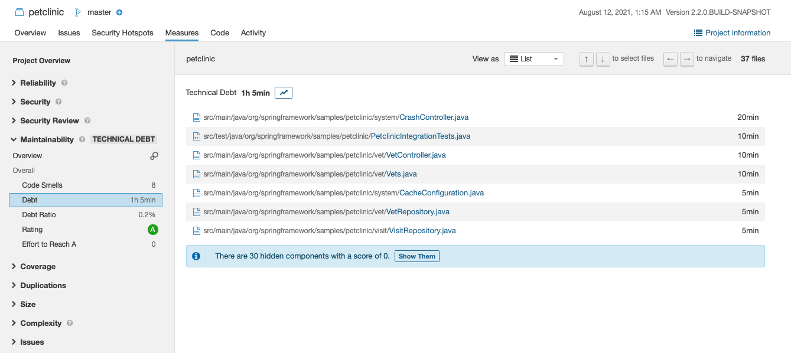

# Lab4: Implementing DevSecOps to Build and Automate Security into the Application in a Secure CI/CD Pipeline

## Goal of Lab 4
The goal of this lab is to learn how to automate and build security into the application and build a secure software factory that orchestrates a combination of different security tools. With the advent of DevSecOps, security is put front and center - it is addressed in terms of people, processes and technology. Security tools are integrated right into the build process and you could easily break the build if security requirements are not met with the security gates that you build into your CI/CD pipeline.

## Introduction

The benefits of DevOps and Continuous Integration / Continuous Delivery (CI/CD) have been demonstrated with great success over the years. Security was initially treated as a second class citizen in many cases - left until the end usually to much detriment. With the advent of DevSecOps, security is put front and center - it is addressed in terms of people, processes and technology. Security tools are integrated right into the build process and you could easily break the build if security requirements are not met with the security gates that you build into your CI/CD pipeline.

This lab exercise will focus on some of the technologies used to implement automated security compliance controls within a typical CI/CD application pipeline.

A number of tools have been installed and pre-configured to support the DevSecOps pipeline. Most of these tools are running containerized within the Red Hat OpenShift cluster. Here are the pipelines we will be stepping through during our lab:

DevSecOps CICD pipeline demo using several technologies such as:

- link:https://www.openshift.com/learn/topics/ci-cd[Openshift Pipelines]
- link:https://www.openshift.com/blog/announcing-openshift-gitops[Openshift GitOps]
- link:https://www.redhat.com/en/resources/advanced-cluster-security-for-kubernetes-datasheet[Openshift Advanced Cluster Security for Kubernetes]
- link:https://docs.openshift.com/container-platform/latest/registry/architecture-component-imageregistry.html[Openshift Container Registry]
- link:https://www.sonarqube.org/[SonarQube]
- link:https://www.sonatype.com/products/repository-oss?topnav=true[Nexus]
- link:https://junit.org/junit5/[JUnit]
- link:https://gogs.io/[Gogs]
- link:https://tekton.dev/docs/triggers/[Git Webhook]
- link:https://gatling.io/[Gatling]
- link:https://www.zaproxy.org/[Zap Proxy]

The script was used to deploy the pipeline can be found link:https://raw.githubusercontent.com/rcarrata/devsecops-demo/main/install.sh[here].
The script uses `Ansible 2.7+` and deploy onto `OpenShift 4.7+`

=== Lab 4.1 Logging into the environment

. Go to https://www.opentlc.com/gg/gg.cgi?profile=generic_na_shchan-redhat.com, enter the Activation Key and your email and click submit.
+
image:pics/requestGUID.png[800,800]
. You will be presented with your user id and GUID as shown below.
+

. Log in to each of the tools that we previously mentioned  with the credentials shown below. Replace *{GUID}* with your provided lab cluster GUID and replace *{USERID}* with your provided user id - e.g., *user1* . Both the lab cluster GUID and USERID can be found on the Lab Information page where you got your assigned GUID and USERID. (see previous step for more details)

* Red Hat OpenShift console - https://console-openshift-console.apps.cluster-{GUID}.{GUID}.example.opentlc.com
+
*login:* {USERID}
+
*password:* openshift
+
=== Lab 4.2 Execute Dev Pipeline
. Login OpenShift from terminal via `oc login -u <username> api.cluster-{GUID}.{GUID}.example.opentlc.com:6443`
. Make sure you have access to the pipeline-build-dev-run.yaml
. Run: `oc create -f pipeline-build-dev-run.yaml -n cicd`
. Run: `oc whoami --show-console`
. Copy the console URL and open the URL from the browser
. Login the console using your credential
. Click to `Developer` to switch to developer console
+

. Make sure you are in the 'cicd' project
+

. Click 'Pipeline' on the left menu to view all pipelines
+

. Click onto PipelineRun (PLR) link
+

. Click onto `source-clone`
+

. Copy the git repo link from the output of the "source-clone" stage
+

. Open a broswer tab with the copied git repo URL
. It should take you to the gogs git repo as shown below
+

. Click onto `gogs` and there are 2 repositories for this lab
. Go back to the OpenShift developer console --> Pipeline --> Pipeline Run
. Click `dependency-report` and you will see the report location at the end of the output
+

. Click `Search` on the left nav menu
. Type 'route' and click route from the list
+

. Click on the reports repo link
+

. Click onto the `petclinic-build` link from the page
+

. Continue to click on spring-petclinic -> target -> site
. Click on the `Dependencies` from the page
+

. You may examine the details from that page by scrolling down
. Go back to the OpenShift developer console --> Pipeline --> Pipeline Run
. Click on the stage `unit-tests`
. Check if the build completed successfully based on the output
+

. Click on `code-analysis` and you can see the analysis was created per the output of the stage
+

. Click `search` and go to the list of routes
. Click the sonarqube link from the list
+

. Click on the link to access sonarqube
+

. Click `1` above project -> click `petclinic`
. You will see the overview of the project's health
+

. Click `1h5min debt` to view all the technical debt
+

. You may explore other information on this page
. Click `release-app` and you can see the nexus repo information
+

. Go back to the route list and click onto the Nexus Repo like
. Click browse -> click `maven-snapshot` and look for the new built
+

. Next, go back the pipeline run and example the build image and you should see the image was build and push to the internal image repository
+

